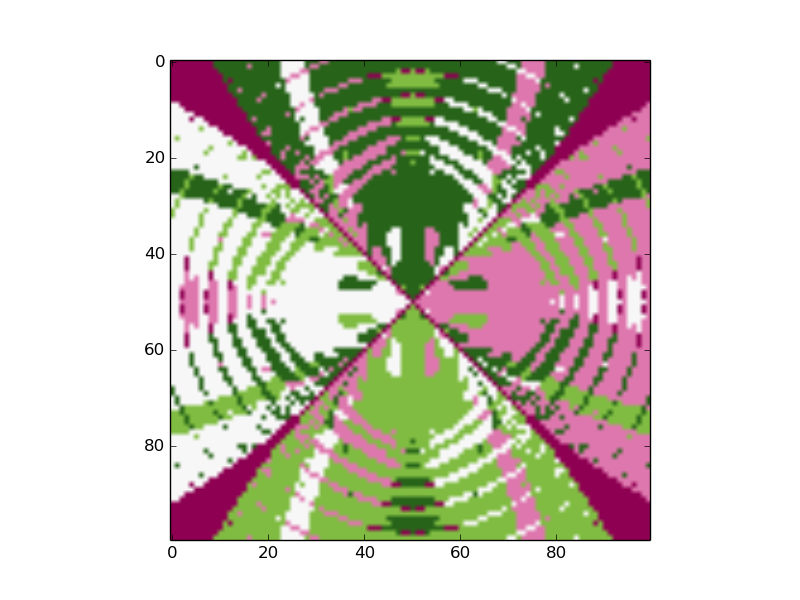

% Optimization Report
% 16 November 2015
% Séb Arnold

# Abstract
In this report we present an analysis of three gradient-based optimization procedures, namely:

* fixed step-size gradient descent,
* Newton's method with backtracking, 
* and the Fletcher-Reeves variant of the conjugate gradient method.

# Mathematical Analysis
The function we will try to optimize in our analysis is the following, for any complex number z:

$$
\min |z^{4} - 1|^{2}  = \min |(x + iy)^{4} - 1|^{2}
$$

Which is equivalent to optimizing:
$$
\min f(x, y) = \min 4x^6y^2 + 30x^4y^4 + 4x^2y^6 + x^8 + y^8 - 2x^4 -2y^4 + 12x^2y^2 + 1
$$
where x and y are real numbers.

The four solutions for the pair (x, y) are (-1, 0), (0, -1), (0, 1), (1, 0). Additionally, the gradient of f(x, y) is:

$$
\nabla f(x, y) =  (\frac{\partial f}{\partial x}, \frac{\partial f}{\partial y})^T
$$
and
$$
\frac{\partial f}{\partial x} = 24x^5y^2 + 24x^3y^4 + 8xy^6 + 8x^7 - 8x^3 + 24xy^2
$$
$$
\frac{\partial f}{\partial y} = 8x^6y + 24x^4y^3 + 24x^2y^5 + 8y^7 - 8y^3 + 24x^2y
$$

We also know that
$$
\nabla f(0, 1) = \nabla f(1, 0) =\nabla f(0, -1) =\nabla f(-1, 0) = 0
$$

Finally, the Hessian of $f(x, y)$ is:

$$
H_{f}(x, y) = ((\frac{\partial^2 f}{\partial^2 x}, \frac{\partial^2 f}{\partial y\partial x})^T, (\frac{\partial^2 f}{\partial x\partial y}, \frac{\partial^2 f}{\partial^2 y})^T)
$$
and
$$
\frac{\partial^2 f}{\partial^2 x} = 120x^4y^2 + 72x^2y^4 + 8y^6 + 56x^6 - 24x^2 + 24y^2
$$

$$
\frac{\partial^2 f}{\partial^2 y} = 8x^6 + 72x^4y^2 + 120x^2y^4 + 56y^6 - 24y^2 + 24x^2
$$

$$
\frac{\partial^2 f}{\partial y\partial x} = \frac{\partial^2 f}{\partial x\partial y} = 48x^5y + 96x^3y^3 + 48xy^5 + 48xy
$$

and we have $H_{f}(-1, 0) = $, $H_{f}(1, 0) = $, $H_{f}(0, -1) = $, $H_{f}(0,
1) = $. Finally note that for $x=0, y=0$, $H_{f} = 0$ and thus its inverse is
undefined. This is important for our computations, and we explain this further
in the documentation of our code.

# Computer Code
All algorithms are implemented using the Python programming language, as well
as other scientific libraries. We first started by implementing a general
version of the gradient descent and Newton's method algorithm based on the
automatic differentiation capabilities of the neon library. This choice was
motivated as we are contributors to the library. Our original code successfully
worked for N-dimensional quadratic functions, without the requirement to
manually compute the gradient nor the Hessian. Unfortunately, we weren't able
to vectorize the desired function $f(x, y)$, and thus had to change our
approach.

We opted for a custom, but less flexible solution where we hand wrote every
aspect of the function. The linear algebra operations are handled by the
*NumPy* and *SciPy* libraries, which provide a MATLAB-like environment for
Python. The code consists of two nested for-loops that iterate over the x-y
values as well as six helper functions.

The final code can be found in the file *exp_np.py* where as the autodiff code
is found in *optimizers.py* as well as *experiment.py*.

### print_matrix and get_conv_color
These two functions are used to handle the graphical side of the application.
*print_matrix* simply creates a PNG graph image of the passed array, where as
*get_conv_color* assigns a label to the result of an optimization procedure,
depending on which local minimum it was closest to.

### Convergence Test
The function *conv_test* is a useful tool used in all of the optimization
procedures. It returns a numerically safe value to compare the distance between
two vectors. We can then simply check for convergence if this distance is
smaller than a predefined $\epsilon$.

### Optimization Procedures
All three of the optimization procedures have their own function, which is
implemented as looping and modifying the current *solution* until convergence.
They all follow the implementation as described in our textbook [1], except for
Newton's method which implements a backtracking routine as found in [2]. An
interesting addition we made to the method of conjugate gradients was to test
for convergence with the previous solution, in addition to testing for the
gradient to be equal to zero. (Step 5 from textbook) This was motivated by the
fact that $f(x, y)$ is not a quadratic, and to account for numerical roundings
and errors. To further account for those kind of errors and exceptions (eg, the
Hessian has no inverse) we surrounded the procedures with *try-except* blocks,
and marked their results with special values.

Finally, in order to have a grasp of the performance of the different
algorithms, we also keep track of how many steps it took them to converge. 

# Comparative and Stability Analysis
First of all, and quite to our surprise, the gradient descent algorithm
performed quite poorly as past a certain range of values for x and y, the
algorithm doesn't converge. While debugging its code, we consistently observed
under- and overflow exceptions. However it is interesting to have a look at the
number of steps required to reach convergence or those exception states. It is clear that
gradient descent is doing different amounts of work (purple means more
iterations) especially along the lines $x=y$ and $x=-y$. The issue of
convergence might come from our choice in the step-size, although it wasn't
clear to us what size might lead to better results. Instead, we experimented
with a maximum amount of steps that the algorithm could take before being
forced to return some value. This allowed us to obtain slightly clearer images,
which are shown thereafter.

Newton's method has very interesting looking shape, almost opposite to the
results obtained by gradient descent. In fact, when starting too close to (0,
0), the algorithm either converges towards the local maximum, or never
converges. (Difficult to say due to the step limit) However we notice that the
same diagonal pattern is present although not as marked as in the conjugate
gradients graph. The reasons for this behaviour is probably due to the Hessian
not meeting the method's expectation. In particular, when $y=0$, and for small
$x < 1$ values, the Hessian is not positive definite, despite being symmetric.
This could be one of the factor behind this convergence behaviour.

Finally, the conjugate gradients method worked best by far. The fractal pattern
is distinctively visible, and the areas requiring most iterations can easily be
analyzed from the graphs. In this case, it seems that most of the computation
time is spent on the same lines as for the gradient descent algorithm, which
was the expected result. In addition it is clear that two nearby points can
reach completely different minimums, as is underlined by the patches of colors
on the first graph.

# References

[1] "An Introduction to Optimization", Chong and Zak, 2013

[2] "Iterative Methods for Sparse Linear Systems", Luca Bergamaschi, 

http://www.dmsa.unipd.it/~berga/newton.pdf
